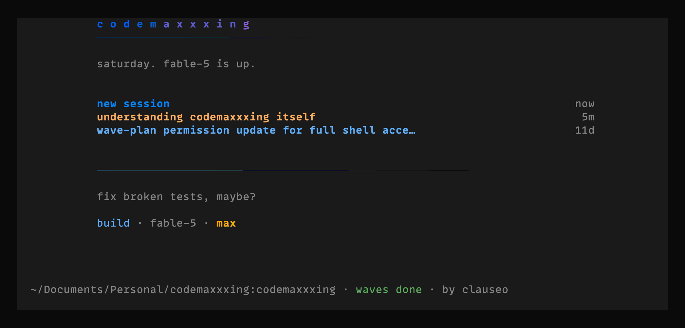
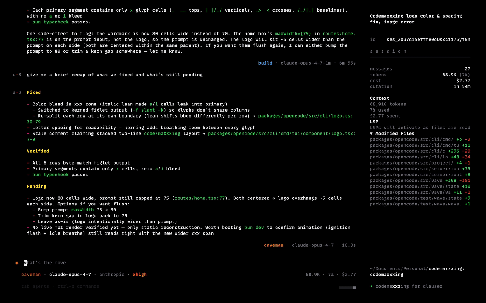

# codemaxxxing



started as a fork of [opencode](https://github.com/anomalyco/opencode). isn't really one anymore. this is the daily coding tool we use internally for everything we build at [clauseo](https://clauseo.chat) and other [bbdeeplearning.systems](https://bbdeeplearning.systems) projects. it's not a product. it's our shop tool, shaped to how we work.

opencode gave us a great starting point and we kept its bones. we then diverged. first on prompts, then on the wave runner, then on the agent communication model, then on the tool surface. when we want a capability another harness has done well, we pull from there too. [openai/codex-cli](https://github.com/openai/codex-cli) was a great reference for persistent processes and concurrent subagents because they'd already solved those problems in a shape close to what we wanted. that doesn't make this a codex port. the architecture is ours; codex just made implementation faster.

five things differ substantially from upstream:

- **[wave runner](#wave-runner)**. a finite state machine that drives large tasks across many fresh AI sessions. auto-retry, in-flight plan amendment, conversational pauses when the agent needs us, full git audit trail.
- **[multi-agent architecture](#multi-agent-architecture)**. concurrent subagents that talk to each other through a mailbox, not fire-and-forget. parents can spawn 5 workers in parallel, message them mid-flight, and integrate results without re-spawning.
- **[persistent processes](#persistent-processes)**. PTY-backed tools (`exec_command` + `write_stdin`) that hold state between calls. REPLs keep their imports. dev servers stay running while you observe their logs. file watchers report new diagnostics as edits land.
- **[drafting-table TUI](#tui)**. lighter chrome, more density, easier to read over mosh + tmux on small windows. plus a wave campaign dashboard.
- **[rewritten prompts](#prompts)**. anti-over-engineering, parallelism baked in, distinguishing questions from action requests. rewritten for Anthropic, Gemini, and other (GLM/Qwen) backends.

the rest of the README walks through each one and how to install. there's a separate [WAVES.md](./WAVES.md) for the full wave-runner algorithm, [GOTCHAS.md](./GOTCHAS.md) for the sharp edges we've accumulated, and per-campaign engineering references in [specs/](./specs/).

## wave runner

long agent sessions degrade. the context window is a sliding window. early details rot, compaction makes knowledge shallow, late-stage errors compound. the wave runner splits large tasks across many small fresh sessions, persists progress on disk as a finite state machine, and recovers from failures by patching the plan or asking us. no babysitting between waves.

three agents:

- `wave_plan` decomposes a plan markdown file into a campaign directory under `.wave/campaigns/<id>/`.
- `wave_verify` sanity-checks the campaign before any wave runs (probes reality with cheap shell commands to catch planner blind spots), and re-amends it whenever a wave fails because the spec was wrong.
- an executor agent (caveman, build, our choice) runs each wave. reads its `WAVE.md`, dispatches sub-agents, runs verification, commits, updates state.

a loop in `packages/opencode/src/wave/loop.ts` orchestrates everything. after we arm it once, every wave completion auto-spawns the next, transient failures auto-retry up to 3 times, and `PLAN UNDOABLE` outcomes auto-escalate to the verifier. when an agent needs user input it pauses conversationally. the session stays alive, we reply in chat, the same agent resumes mid-thread. every outcome (success, failure, undoable, paused, crash) produces a git commit, so the working tree is always clean between sessions and we have a full audit trail in `git log`.

**workflow**:

1. **plan.** write a plan in plain markdown anywhere, or use `/mode plan` (iterative) or `/agent plan_structured` (4-phase pipeline) to produce one in `.opencode/plans/`.

2. **decompose.** new session, switch to wave_plan via the `/wave-plan` slash command. the slash pre-fills a prompt asking for the plan path and executor agent. model is optional, leave unspecified to use codemaxxxing's default.

   ```
   /wave-plan
   Decompose @.opencode/plans/my-plan.md. Executor agent: caveman.
   ```

   this produces `.wave/campaigns/<id>/`. no source code is modified.

3. **arm and walk away.** open `/wave` in the TUI. press `r`. the verifier runs first (sanity-checks the campaign). then the executor spawns wave 0, runs it, commits, advances state. the loop sees the settle, spawns wave 1. repeats until `all_complete`.

4. **respond to questions.** when the dashboard shows a USER ATTENTION banner, press `↵` on the wave row to open the session in chat. read the agent's full contextual question, reply normally. the agent picks up the reply and continues.

read more: [WAVES.md](./WAVES.md) for the full algorithm, FSM states, set phrases, recovery paths, and architectural choices.

## multi-agent architecture

opencode's `task` is fire-and-forget. parent calls task, child runs to completion, parent gets back a single text string. no channel back during execution. no concurrent siblings. no observable status. fine for "go grep the codebase". falls apart for everything else we kept wanting to do: parallel fan-out with N explorers, observer + worker patterns, debate between two framings, long-running siblings the parent checks in on later.

we replaced it. six tools, all backed by an `AgentControl` service with per-root agent registry and per-session mailbox.

| Tool | What it does |
|---|---|
| `spawn_agent` | fire-and-keep-running. returns immediately with the child's canonical path. parent keeps working. |
| `send_message` | FYI queue. message lands in recipient's mailbox; recipient sees it on their next turn. |
| `followup_task` | queue AND wake. recipient picks up the work immediately. |
| `wait_agent` | block on any mailbox update. use only when genuinely blocked. |
| `list_agents` | snapshot of every live agent in your session tree. status, last instruction. cheap. |
| `close_agent` | release a slot. cascades through descendants. |

the spawn tree is depth-limited (4 levels under `/root`). each agent runs in its own fiber, makes its own LLM calls, can spawn its own descendants. siblings push results to each other via `send_message` or `followup_task`; results land in the recipient's mailbox and get drained automatically at the start of the recipient's next turn (shown as `[from <author>] ...` prefixed entries).

a sibling watcher fiber forks at every spawn. when the child reaches a final, non-shutdown status, the watcher posts a completion notification to the parent's mailbox. parent's `wait_agent` wakes within milliseconds.

per-root scoping is the structural invariant. two chat sessions opened against the same project don't see each other's subagents. each registered root gets its own slot (registry, mailboxes, statuses, fibers). a `sessionToRoot` index resolves any session id to its root in O(1). every service method routes through the slot resolver before doing anything.

scenario-level coverage lives at `packages/opencode/test/integration/multi-agent-invariants.test.ts`. 13 invariants, each `it.instance` walks the scenario the invariant describes and asserts what a user would observe. every wave touching multi-agent code must add at least one invariant before its production code lands. coverage alone is necessary but not sufficient. the harness is what catches the composed-primitives bugs (multi-chat collision, wait_agent never waking, agent_type not validated) that 100% line coverage missed.

engineering reference: [specs/codex-parity.md](./specs/codex-parity.md) for the initial port, [specs/codex-parity-hardening.md](./specs/codex-parity-hardening.md) for the per-root scoping + completion watcher fixes that came after.

## persistent processes

opencode's `bash` is one-shot. every call spawns a fresh process and exits when the command does. fine for `ls`, `git status`, `mkdir`. useless for REPLs, dev servers, file watchers, anything that holds state.

we replaced it with two tools backed by a 64-process PTY pool.

| Tool | What it does |
|---|---|
| `exec_command` | spawn a process. returns the initial output plus a `session_id`. process stays alive past the call. |
| `write_stdin` | re-enter a session. send input (with `chars`), poll for output (with empty `chars`), or both. |

state stays between calls. boot a Python REPL once, load imports once, run 50 expressions against the same in-memory state. spin up `next dev`, edit a file, poll for new log lines as the server reacts. tail `kubectl logs -f` in one slot while the main thread does other work.

operational guarantees match what other harnesses have settled on: 64-process LRU pool, head/tail-buffered output (50/50 split inside 1 MiB so the model always sees both prologue and recent activity), yield-time clamps tuned to keep REPLs responsive and prevent spam-polling (5s floor on empty polls, 250ms floor on input-sending writes, 30s ceiling everywhere). `tty: true` is required if you intend to send stdin later; without it the connection is one-way.

the model-spawned PTYs persist past process exit so the model can drain final output via a follow-up empty poll. desktop-spawned PTYs (from the TUI terminal pane) keep their old auto-remove-on-exit behavior. distinguished by an `origin: "tui" | "model"` field on `Pty.Info`.

engineering reference: [specs/codex-parity.md](./specs/codex-parity.md).

## tool surface

the model's tool list no longer shows `bash` or `task`. they're covered by `exec_command` plus `write_stdin` for shell work and the six v2 multi-agent tools for agent-spawning. cleaner: no decision overload, no near-duplicate tools competing for the same intent.

saved permissions keep working without edits. permission key collapse:

- `SHELL_TOOLS = ["bash", "exec_command", "write_stdin"]` all consult permission key `bash`. saved `permission.bash: { "git *": "allow" }` rules transparently gate the new tools.
- `MULTI_AGENT_TOOLS = ["task", "spawn_agent", "send_message", "followup_task", "wait_agent", "list_agents", "close_agent"]` all consult permission key `task`. saved `permission.task: { "explore": "allow" }` gates the new tools too.

mirror of the existing `EDIT_TOOLS` precedent (where `edit`, `write`, `apply_patch` all consult permission key `edit`).

`tools: { bash: false }` and `tools: { task: false }` now hide every member of their respective group from the model's tool list. pre-campaign they hid only the literally-named tool.

plugin migration: `tool.definition` hooks keyed on `bash` or `task` continue to fire via a bridge in `tool/registry.ts:407-421`. mutations land on `exec_command` or `spawn_agent`'s description automatically. `tool.execute` hooks must migrate to the new IDs explicitly. execution semantics differ between the pairs (one-shot vs persistent for shell; single-shot vs concurrent-interactive for agents) and bridging would break plugin expectations.

`shell.ts` and `task.ts` are not deleted. both remain importable and callable from internal code. they're just no longer advertised to the model.

engineering reference: [specs/replace-bash-task.md](./specs/replace-bash-task.md).

## tui



lighter, more information-dense chrome. easier to read over mosh + tmux on smaller windows. personal preference. not a feature, just our taste.

most of it is subtraction. panels lose their backgrounds and become single-cell left rules. message blocks lose their closing rules. tool calls collapse to `label · target · meta` instead of labeled separator lines. speaker identity moves to a `u·1` / `a·1` mark in the left margin. sidebar gains a small live stats block (messages, tokens, cost, duration). prompt has a state-aware `▎` accent and a two-row status (identity + ephemeral hints) with a small usage meter.

logo is a `slant`-figlet wordmark with a subtle ignition to idle animation. prompt spinner is a turbo spool (two braille turbines plus a boost gauge) instead of the upstream V12. sidebar footer reads `codema(xxx)ing for clauseo`. home footer `by clauseo`. OSC terminal title `codemaxxxing` (home) or `cmx | <session>` (sessions).

the recording above shows codemaxxxing in toybox-noir theme with the caveman agent active, mid-response. the spinner is the turbo spool.

also:

- collapsible web search and code search result displays
- semantic rendering of multi-agent v2 tool calls (spawn / send / wait / list show as proper components, not just JSON blobs)
- cross-agent mailbox messages render distinct from regular user input, prefixed with `[from <author_path>]`
- per-session subagent status strip in the footer when concurrent siblings are live (4 fields: total, running, completed, errored)
- subagent navigation works at any depth, not just direct children of root
- **flush queued messages on demand.** hit Enter while a turn is running, the message lands in the session log with a ` queued ` badge as today. press `<leader> ⏎` (default `ctrl+x` then `return`) to interrupt the current model stream and process the whole queue immediately. partial assistant text and in-flight tool calls are preserved on the abort so the model sees what it was in the middle of doing, then the queued messages, then responds. footer hint reads `esc interrupt · <leader> ⏎ flush N queued` when applicable. configurable via `keybinds.session_flush_queued`. see [flush-queued change notes](./CHANGES/2026-05-18-flush-queued.md).
- `/wave` slash command for the wave campaign dashboard
- `/wave-plan`, `/wave-run`, `/wave-pause`, `/wave-stop`, `/wave-next` slash commands for campaign control
- wave footer pill on home shows active campaign + status when one exists

## prompts

we keep iteration logs in [`PROMPT_ITERATIONS/`](./PROMPT_ITERATIONS/) and corresponding change lists in [`CHANGES/`](./CHANGES/). the reason isn't process discipline. it's that we forget what we tried. when something starts misbehaving again, the logs are how we find what we already learned. each iteration follows the same structure:

1. **discovery**. what behavior is going wrong, with concrete examples.
2. **research**. how Claude Code, Cursor, Ralph, codex, and community patterns handle it.
3. **solution**. exact files changed and why.
4. **observe**. what to watch for to know if it worked.

a full index of files differing from upstream is in [`CHANGES/INDEX.md`](./CHANGES/INDEX.md).

| Iteration                                                      | Date       | Focus                                                                                            |
| -------------------------------------------------------------- | ---------- | ------------------------------------------------------------------------------------------------ |
| [1](./PROMPT_ITERATIONS/2026-02-15-initial-fork.md)            | 2026-02-15 | Initial fork: anti-over-engineering, explore lockdown, context isolation, plan mode              |
| [2](./PROMPT_ITERATIONS/2026-02-22-explore-delegation.md)      | 2026-02-22 | Explore agent delegation: split broad tasks into parallel focused agents, stop code dumps        |
| [3](./PROMPT_ITERATIONS/2026-02-22-prompt-parity/ITERATION.md) | 2026-02-22 | Prompt parity: Gemini system prompt rewrite, native general subagent prompts                     |
| [4](./PROMPT_ITERATIONS/2026-02-23-anthropic-inquiry-mode.md)  | 2026-02-23 | Anthropic inquiry mode: distinguish questions from directives                                    |
| [5](./PROMPT_ITERATIONS/2026-02-24-qwen-prompt-sync.md)        | 2026-02-24 | Default prompt sync: full codemaxxxing prompt for GLM and non-Claude models                      |
| [6](./PROMPT_ITERATIONS/2026-04-11-caveman-agent.md)           | 2026-04-11 | Caveman agent: ultra-terse primary agent, terse subagent output rules                            |
| [7](./PROMPT_ITERATIONS/2026-05-06-wave-system.md)             | 2026-05-06 | Wave system overhaul: verifier agent, retry/escalation FSM, conversational user pause            |
| [8](./PROMPT_ITERATIONS/2026-05-13-multi-agent-and-tool-overhaul.md) | 2026-05-13 | Multi-agent architecture + tool surface overhaul: replaced `task` and `bash` from the model's view |

### system prompts

the Anthropic, Gemini, and default (GLM/Qwen/other) system prompts have all been rewritten with our flavour:

- **anti-over-engineering**. don't add features, abstractions, error handling, or comments beyond what was asked.
- **inquiry vs directive awareness**. distinguish questions and discussions from action requests. don't start implementing when the user is exploring ideas.
- **security awareness**. actively watch for OWASP top 10 vulnerabilities in generated code.
- **no time estimates**. never predict how long tasks will take.
- **blast radius awareness**. freely take reversible actions, flag destructive ones before proceeding.
- **parallelism**. the prompts encourage parallel tool calls and parallel subagent launches wherever independent work exists. this keeps sessions shorter, context cleaner, and is what makes patterns like the wave runner practical.

the Gemini prompt is adapted for Gemini's response patterns: prescriptive framing over prohibitions, context efficiency guidance, Directives/Inquiries distinction, Research-Strategy-Execution lifecycle. see [iteration 3](./PROMPT_ITERATIONS/2026-02-22-prompt-parity/ITERATION.md) and the [research learnings](./PROMPT_ITERATIONS/2026-02-22-prompt-parity/LEARNINGS.md) for the rationale.

### capability hint fragments

`SystemPrompt.capabilityHints(agent)` at `packages/opencode/src/session/system.ts:101` injects up to three fragments into the system prompt at session bootstrap, based on the agent's effective permission set:

| Fragment | When injected |
|---|---|
| `persistent-processes.txt` | agent has `exec_command` permission != deny |
| `multi-agent-root.txt` | `agent.mode !== "subagent"` AND `spawn_agent` permission != deny |
| `multi-agent-subagent.txt` | `agent.mode === "subagent"` AND (`send_message` OR `wait_agent`) permission != deny |

agents with a tool denied don't see hints about that tool. compaction, title, and summary agents (which deny everything wildcard-wise) get an empty hint list. their existing system prompts are unchanged.

### general subagent

in upstream OpenCode, the general subagent inherits its system prompt from the parent verbatim. we ship native general subagent prompts (one for Anthropic models, one for Gemini) purpose-built for task execution with anti-over-engineering rules and structured reporting back to the parent. model selection happens automatically via `Agent.resolvePrompt()` in `agent.ts`. custom agents defined via `.opencode/agent/` config still take precedence.

### explore agent

the explore agent prompt has been overhauled for speed and strictness:

- hard read-only enforcement with an explicit deny list for destructive commands
- parallel tool call patterns for faster search
- structured thoroughness levels (quick / medium / very thorough)
- machine-readable response format (absolute paths, code snippets, explicit negatives)
- concise findings. key function signatures and critical logic, not entire file dumps.

the main agent's delegation to explore has been tuned to prevent context bloat (iteration 2):

- broad questions are split into multiple parallel explore agents, each targeting one area or concern
- the main agent uses Read directly when it already knows file paths, instead of wasting an explore agent on file reading
- explore agents are always given a thoroughness level and starting-point directories

our setup uses Claude Opus 4.6 as the primary model with the explore agent specifically running on Gemini 3 Flash. to use this, add the following to your `opencode.json`:

```json
{
  "agent": {
    "explore": {
      "model": "google/gemini-3-flash-preview"
    }
  }
}
```

the explore prompt is structured to account for that pairing. consequences on different model setups are not tested.

### plan mode

both plan modes (the built-in `/mode plan` and the `plan_structured` custom agent) produce self-contained markdown plans in `.opencode/plans/`. these plans are designed to be picked up by fresh agents with zero context from the planning session.

the built-in plan mode (`/mode plan`) is iterative. it pair-plans with you: explores the codebase, updates the plan incrementally, asks you questions when it hits ambiguities only you can resolve. it loops (explore, update, ask) until the plan is complete. good for open-ended tasks where the scope needs discussion.

the `plan_structured` custom agent is a linear pipeline. you provide the task definition upfront, and it runs a 4-phase workflow: survey the codebase with parallel explore subagents, organize findings and identify gaps, write the full plan, then verify file paths and snippets are accurate. it works with you directly and asks questions on genuine ambiguities, but its value-add is the thorough autonomous survey and structured documentation, not problem discovery. good for well-defined tasks where you know what you want and need the codebase mapped out.

both are read-only. they never modify source code. both produce plans with the same required sections: context, codebase analysis, approach, changes, dead ends, verification, and dependencies. either plan can be fed into the wave runner.

use `/mode plan` when you're still figuring out what you want. you have a rough idea but need to talk through the approach, explore tradeoffs, and refine scope as you go. use `plan_structured` when you already know what needs to happen and just need the agent to survey the codebase and document the execution path.

### subagent permissions

the explore agent's bash access is locked down with explicit deny rules for destructive commands (`rm`, `git push`, `npm install`, etc.) while allowing read-only commands (`ls`, `find`, `git log`, etc.). per-built-in defaults for the new multi-agent and persistent-process tools live at `packages/opencode/src/agent/agent.ts:107-301`. `build` and `general` allow everything; `explore` allows messaging but not spawning or closing; `plan` denies all new tools; `compaction`, `title`, and `summary` deny everything wildcard-wise.

### caveman agent

a custom primary agent that produces ultra-terse output. about 75% fewer output tokens while keeping full technical accuracy. based on [JuliusBrussee/caveman](https://github.com/JuliusBrussee/caveman). switch to it via the agent selector.

the system prompt is a 1:1 copy of `anthropic.txt` with caveman communication rules prepended. rules are sourced from the caveman skill's core SKILL.md (ultra mode: abbreviations, arrows, fragments) and the compress skill's SKILL.md (granular remove/preserve/structure spec). the TodoWrite examples are rewritten in caveman style for consistency.

the `build` agent remains the default for normal conversational use. we use `caveman` when we want maximum speed and token efficiency and don't need verbose explanations.

both the general and explore subagent prompts also have caveman output rules, tailored to each agent's role:

- **general subagent**. terse implementation reporting. no progress narration. state file changed, what changed, why. failure reports state what was tried and where blocked.
- **explore subagent**. terse search findings. no search narration. lead with file path + line number. group by area, not search order.

subagent caveman rules are always active regardless of which primary agent is selected. they reduce token usage in agent-to-agent communication where no human reads the output.

### custom agents

the `general` subagent prompt now ships natively (see [general subagent](#general-subagent) above). the remaining custom agents in `custom_agents/` need to be copied to your config directory:

```bash
cp custom_agents/docs.md custom_agents/plan_structured.md custom_agents/wave_plan.md custom_agents/wave_verify.md ~/.config/opencode/agent/
```

- **docs**. technical documentation writer with specific style constraints (short chunks, imperative headings, relaxed tone).
- **general**. custom system prompt for the general subagent. now shipped natively (iteration 3). this file remains as a reference.
- **plan_structured**. structured planning with a 4-phase pipeline: survey (parallel explore subagents), organize, write, verify. you provide the task upfront; the agent's value-add is thorough codebase survey and structured documentation. asks questions on genuine ambiguities. read-only.
- **wave_plan**. wave decomposition. takes a plan markdown file and produces a campaign under `.wave/campaigns/<id>/` (`AGENT_INSTRUCTIONS.md`, `OVERVIEW.md`, `STATE.md`, and per-wave `WAVE.md` files). read-only outside `.wave/`. loop-managed after the first decomposition.
- **wave_verify**. wave review + amendment. auto-runs after every decomposition (sanity-checks the plan against reality) and again whenever a wave fails in a way that suggests the spec itself is wrong. patches the plan in place, escalates to user if it can't decide alone. broad permissions; behaviorally constrained to `.wave/`.

## knowledge base and integration discipline

two artifacts that emerged from the campaigns and have outsized value going forward.

[`GOTCHAS.md`](./GOTCHAS.md) is the sharp-edges knowledge base. each entry is one painful debugging session distilled to a fix pattern. progressive disclosure: load the indexes first (`Read GOTCHAS.md limit=200` for about 4 KB), then jump to specific entries by slug with offset reads. covers Effect v4 renames, Bus and InstanceState lifetime traps, opentui render antipatterns, Bun coverage quirks, PTY origin gating, perf bench methodology, permission routing. read before doing the matching kind of work; you'll save the same hours we did.

`INTEGRATION_INVARIANTS.md` (per-campaign, lives in each campaign's archive under `.wave/campaigns/<id>/plan/`) plus the test harness at `packages/opencode/test/integration/` is the discipline. each invariant names a scenario the system must hold. each `it.instance` walks the scenario and asserts what a user would observe. coverage is necessary; the harness is sufficient. the structural bugs that survived 100% line coverage in the codex-parity campaign (multi-chat collision, wait_agent never waking, agent_type not validated) are the empirical proof. future work touching multi-agent or tool-surface code must add at least one invariant before its production code lands.

## if you ever fork this

the prompts contain our identity. if you happen to be using this, fork it, change the identity in these files first:

- `packages/opencode/src/session/prompt/anthropic.txt`. name, org, and identity in the Anthropic system prompt.
- `packages/opencode/src/session/prompt/qwen.txt`. same for the default prompt (GLM, Qwen, and other non-specifically-matched models).
- `packages/opencode/src/session/prompt/gemini.txt`. same for the Gemini system prompt.
- `packages/opencode/src/agent/prompt/explore.txt`. explore agent identity.
- `packages/opencode/src/agent/prompt/general/anthropic.txt`. Anthropic general subagent identity.
- `packages/opencode/src/agent/prompt/general/gemini.txt`. Gemini general subagent identity.

## installation

### from source (development)

```bash
bun dev
```

### standalone binary

```bash
# build
./packages/opencode/script/build.ts --single

# make executable
chmod +x ./packages/opencode/dist/opencode-darwin-arm64/bin/opencode

# or

chmod +x ./packages/opencode/dist/opencode-darwin-x64/bin/opencode

# symlink to PATH
ln -sf "$(pwd)/packages/opencode/dist/opencode-darwin-arm64/bin/opencode" ~/.local/bin/codemaxxxing

# or

ln -sf "$(pwd)/packages/opencode/dist/opencode-darwin-x64/bin/opencode" ~/.local/bin/codemaxxxing
```

make sure `~/.local/bin` is in your `PATH`. if not, add to your `.zshrc`:

```bash
export PATH="$HOME/.local/bin:$PATH"
```

## license

same as upstream OpenCode. see [LICENSE](./LICENSE).
