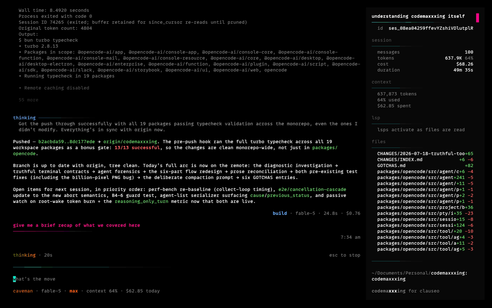

# codemaxxxing


the question driving this repo started simple: how large a task can I hand off and leave running while I do something else? the models kept answering it, and every time they did the question changed units. one task at a time became one long task, then a few tasks on one machine, now many tasks across many machines. the current form is different in kind: how many agents can run without me, how far from the keyboard can I be, and what actually earns my attention when something blocks?

cmx is how I chase that. it began as prompt modifications on top of [opencode](https://github.com/anomalyco/opencode), grew a wave runtime when models degraded over long sessions, grew an actor system when I wanted real concurrency, and is now the runtime under a fleet: always-on `cmx serve` daemons on my mac and a handful of vms, running agent trees around the clock, driven from wherever I am. it is the daily tool for [clauseo](https://clauseo.chat) and other [bbdeeplearning.systems](https://bbdeeplearning.systems) work, and the surface where longer-running agent shapes get proven before they reach clauseo's production agents. it shares a file tree with upstream and very little else. nothing here is a product or a configurable platform; it is an instrument I evolve as my own needs evolve, and parts of it get re-litigated every time a model ships.

two windows sit on this runtime:

- **boxbox** is the primary one now. a web pit wall for the fleet: next.js pwa, one codebase for phone, tablet and desktop, running on its own always-on vm. it watches every serve server-side and inverts attention: everything blocking any agent on any machine flows into one ranked needs-you inbox, web push carries the call to my lock screen, and review requests from agent checkouts arrive as cards I can merge from the phone. named for the f1 radio call that means come in NOW. the repo is private while it hardens; it will be public.
- **the tui** is the other: the comfort cockpit. it exists for the setups where a terminal is the right surface (ssh or mosh, tmux, an ipad or even a phone, hotel wifi) and stays light enough to feel good there. these days it opens mostly while I build boxbox, and whenever boxbox can't be the surface I work from.

what the runtime grew that upstream doesn't have:

- a serve layer built for fleets, not sessions: multi-client sse, a global event and control surface, config hot-reload, host-scoped run locks, two http backends held to parity. → [**the runtime and the fleet**](#the-runtime-and-the-fleet).
- subagents that behave like real actors instead of fire-and-forget RPC calls: concurrent, addressable, supervisable, with mailboxes, links, bounded queues, and per-agent_type behavior contracts. plus git worktree checkouts with declared review, so parallel writers never share a working directory. → [**multi-agent actor system**](#multi-agent-architecture).
- shell tools that hold state between calls so REPLs keep their imports, dev servers stay running while I observe their logs, file watchers report new diagnostics as edits land. → [**persistent processes**](#persistent-processes).
- a wave runner for the work that still outruns the current models: a finite state machine on disk with auto-retry, conversational user pauses, and a full git audit trail. → [**wave runner**](#wave-runner).
- a TUI that's readable on the setups above: no borders anywhere, structure made of fades, information has temperature. → [**afterglow TUI**](#tui).
- system prompts that don't over-engineer, don't moralise, distinguish questions from action requests, and parallelize aggressively. ten iterations and counting, now net-deleting prose as the models absorb the basics. → [**rewritten prompts**](#prompts).

the rest of the README walks through each one and how to install. there's a separate [WAVES.md](./WAVES.md) for the full wave-runner algorithm, [GOTCHAS.md](./GOTCHAS.md) for the sharp edges accumulated along the way, and per-campaign engineering references in [specs/](./specs/).

## the runtime and the fleet

the center of gravity is `cmx serve`: a long-lived daemon, one per machine. the tui attaches to it, boxbox proxies to all of them, the js sdk hits the same api. sessions live server-side; a client is a viewport, never the runtime. that inversion is what makes "close the laptop, check the phone later" a non-event: sse reconnect is a resync, not a recovery.

what being an engine (instead of an app) forced:

- **multi-client by default.** any number of clients can watch one session over sse (pubsub fan-out), and a host-scoped run lock (an on-disk flock protocol with heartbeats) guarantees at most one agent loop per session across instances and processes. a phone tap and a terminal keystroke can never race two laps onto one transcript. session verbs that arrive without routing headers resolve to the session's home directory, not the receiving process's cwd.
- **a global surface for fleet clients.** `GET /global/event` multiplexes every instance on a host into one envelope stream. `GET /global/fs` browses the host's directories, so a session can be composed into any repo on any machine from anywhere. `POST /global/reload` flushes config, skill and mcp caches live; `POST /global/restart` exits cleanly for the supervisor to relaunch. config edits hot-reload into running serves, so a restart means a binary upgrade and nothing else.
- **instance routing.** an `x-opencode-directory` header selects (and can boot) the project instance a request lands in. one serve fronts every repo on its machine.
- **two http backends, one contract.** every route lands in both the hono backend and the effect httpapi backend, held together by json-parity pins; the openapi doc and the sdk generate from the httpapi contract.
- **tool output structured for rendering, not just for models.** grep and glob ship typed hits in metadata so clients render designed cards instead of parsing prose. shell tools attach freshly written screenshots as image parts: "screenshot saved to /tmp/x.png" becomes pixels in the transcript on whatever device I read it from.
- **fleet-shaped hardening.** provider byte-size ceilings classify as context overflow instead of wedging a session forever; worktree failures ride typed 400s through the auth middleware on both backends; version skew between machines is treated as an incident, not a shrug. the scar tissue lives in [GOTCHAS.md](./GOTCHAS.md).

the fleet this serves today: my mac plus always-on vms, every machine running one persistent serve, agents coding whether or not a laptop lid is open. boxbox watches all of it. the failure modes are fleet failure modes now (locks across processes, clients racing, machines drifting apart), and the recent git history is mostly the runtime earning that.

## multi-agent architecture

upstream's `task` is fire-and-forget. parent calls task, child runs to completion, parent gets back a single text string. no channel back during execution. no concurrent siblings. no observable status. no supervision. fine for "go grep the codebase". falls apart for everything else I kept wanting to do: parallel fan-out with N explorers, observer + worker patterns, debate between two framings, long-running siblings the parent checks in on later, fault tolerance when one of those siblings crashes mid-flight.

I replaced it with a real actor system. ten tools, all backed by an `AgentControl` service with per-root agent registry, per-session bounded mailboxes, supervision strategies, link cascades, and per-`agent_type` behavior contracts. erlang/otp/akka conceptual lineage adapted for LLM constraints: `on_failure: respawn` mirrors OTP supervisor `restart: permanent`, `pool_strategy: one_for_all` is OTP one_for_all, `link_agents`/`unlink_agents` are erlang `link/1`/`unlink/1`. deliberately NOT imported: lifecycle hooks (preStart/postStop don't help LLM subagents), deep escalation chains (LLM cost makes them expensive), or persistence (state lives in messages, not in subagent memory across crashes).

### the ten tools, grouped

**lifecycle**

| Tool | What it does |
|---|---|
| `spawn_agent` | fire-and-keep-running. returns immediately with the child's canonical path. parent keeps working. accepts `on_failure: respawn / escalate / ignore / kill_pool` and `pool_strategy: one_for_one / one_for_all / rest_for_one`. `model` overrides the child's model as `provider/model`, `reasoning_effort` picks a variant; both are validated at spawn time (unknown model or invalid variant fails the call instead of silently spawning on the wrong model). unset means the child runs its agent type's configured model, else inherits the spawner's model (nearest ancestor in the spawn chain with a model pick), else the machine-global default. `isolation: "worktree"` gives the child its own git checkout. `files` attaches file contents to the child's first message. `fork_turns` controls inherited history and defaults to `none`: children are isolated context windows, history copy (`all` / last-N) is a deliberate opt-in. |
| `close_agent` | release a slot. cascades through descendants. `target` is optional (self-close); returns `already_terminated` (success: child exited before close arrived) vs `path_invalid` (model bug: wrong path). |

**messaging**

| Tool | What it does |
|---|---|
| `send_message` | FYI queue. message lands in recipient's mailbox; recipient sees it on their next turn. optional `correlation_id` pairs request to reply. returns `mailbox_full` with `retry_after_ms` hint on overflow. |
| `followup_task` | queue AND wake. recipient picks up the work immediately. same `correlation_id` + `mailbox_full` shape as `send_message`. |

**waits**

| Tool | What it does |
|---|---|
| `wait_agent` | block on any mailbox update. emits `missing_timeout` warning when `timeout_ms` is omitted, `timeout_clamped` when above the 600000ms cap. |
| `wait_for_reply` | targeted variant. blocks until a mailbox message carrying the matching `correlation_id` arrives. wakes only on the matching reply; ignores unrelated mailbox traffic. |

**fan-out**

| Tool | What it does |
|---|---|
| `spawn_pool` | declarative N-worker fan-out under a shared pool_id. three collect strategies: `all` (wait for every member), `first` (race; runtime closes losers), `any_n` (quorum: return when K members deliver, leave the rest alive). spawning is non-atomic; failures land in a `failures[]` array. members can take worktree isolation too: N writers, zero trampling. |

**linking**

| Tool | What it does |
|---|---|
| `link_agents` | forge a bidirectional symmetric paired-death edge between two peers. when either terminates non-gracefully (crash, runtime error, close from above), the runtime cascades the death to every linked partner with the `linked_death` label. |
| `unlink_agents` | drop the edge. symmetric + idempotent. |

**introspection**

| Tool | What it does |
|---|---|
| `list_agents` | snapshot of every live agent in your session tree. status, last instruction. cheap. |

### runtime model

the spawn tree is depth-limited (4 levels under `/root`). each agent runs in its own fiber, makes its own LLM calls, can spawn its own descendants. siblings push results to each other via `send_message` or `followup_task`; results land in the recipient's mailbox and get drained automatically at the start of the recipient's next turn (shown as `[from <author>] ...` prefixed entries).

a sibling watcher fiber forks at every spawn. when the child reaches a final, non-shutdown status, the watcher posts a completion notification to the parent's mailbox. parent's `wait_agent` wakes within milliseconds.

### worktree isolation and declared review

parallel writers don't share a working directory. with `isolation: "worktree"` the child gets its own git checkout on its own branch (named from its task name) under the data dir, booted alive before its first turn: tracked files, `.worktreeinclude`-declared ignored files (.env, node_modules), a running instance, start scripts. clean checkouts remove themselves at terminal status; checkouts with commits are kept, and the completion notification reports branch, commits ahead and dirt so the parent merges, sends back, or discards. respawned children continue in the same checkout. creation refuses under low disk or past a per-project checkout cap, because a fleet machine is a shared machine.

review is declared, never inferred. a checkout-homed root calls `request_review` when the deliverable is done (committed, verified, coherent as one unit); that emits `worktree.review.requested` on the checkout's own directory, and clients raise the review lane on that event and only that event. the note becomes the review card's headline. merge is a local squash-merge on the machine that owns the checkout, discard snapshots dirty work to a rescue commit first, and both refuse to touch a checkout while an agent holds its run lock: a tap on a phone can never delete a working directory under a running agent. checkout-homed sessions are told their role at bootstrap: children commit and never push (the parent decides), roots integrate child branches and then declare.

### supervision

`spawn_agent` accepts `on_failure` to declare what happens when a child terminates non-gracefully: `escalate` (default; the runtime forwards the completion notification with terminal status), `respawn` (re-spawn at the same task_name with a fresh session id, capped at 3 attempts then escalates with `transient_tool_error`), `ignore` (swallow the failure silently, no completion notification; for fire-and-forget probes), `kill_pool` (cascade to the pool; applies to pool members only).

`pool_strategy` controls how a failure in one pool member affects siblings (OTP-style): `one_for_one` (default; failures are isolated), `one_for_all` (any single failure tears down the entire pool), `rest_for_one` (any failure tears down members spawned after the failing one).

### model routing

worker models are pinned per agent type, so picking the agent type is the routing decision: fable 5 drives, `general` runs opus 4.8 for specced parallel engineering, `worker` runs sonnet 5 for fully-specced mechanical edits, `mule` runs gemini 3.6 flash for bulk reads, explore runs sonnet 5. spawn-time overrides route judgment work up and mechanical work down. the matrix, the three-condition delegation gate (complete spec, machine-checkable success, disposable output) and the escalation ratchet live in a per-machine `~/.config/opencode/AGENTS.md` (iteration 10), not in code: routing policy changes faster than binaries ship.

### bounded mailboxes

every agent's mailbox is bounded (default 32 user messages). sends to a full mailbox return `{ error: "mailbox_full", retry_after_ms: 250 }` instead of queueing. callers retry with backoff or use `followup_task` to wake the recipient so it drains. completion notifications from terminating subagents bypass the cap: your subagent crashing always notifies you regardless of mailbox state.

backpressure surfaces context rot before it cascades. the alternative (unbounded mailboxes) lets a stuck subagent's inbox accumulate hundreds of messages while the supervisor thinks everything is fine; the bound makes that situation visible as a tool error the model can react to.

### behavior contracts

each `agent_type` declares a `BehaviorContract` (e.g. `general` requires `send_message_to_spawner` before terminating; `explore` requires read-only completion). at terminal-status time the runtime computes `BehaviorViolation`s against the declared contract and attaches them to the parent's notification as a `behavior_violation` struct. observer-only: spawn returns successfully regardless; the orchestrator decides whether to pivot, retry, or abort.

custom agents declared in `.opencode/agent/` inherit no contract by default. per-spawn override via `spawn_agent(..., behavior_version: "subagent_v2")`.

### per-root scoping

per-root scoping is the structural invariant. two chat sessions opened against the same project don't see each other's subagents. each registered root gets its own slot (registry, mailboxes, statuses, fibers, supervision policies, links, behaviors). a `sessionToRoot` index resolves any session id to its root in O(1); a `sessionHome` index resolves any session to its owning instance, so isolated children in worktree checkouts still find their tree. every service method routes through the slot resolver before doing anything.

### the delivery contract

subagents MUST deliver their result via `send_message` or `followup_task` to their spawner before calling `close_agent`. text-extraction from the subagent's final assistant message is a fallback, not the primary path. when the safety net fires (subagent terminated silently with no substantive body), the parent's notification is prepended with a ⚠️ warning so the gap is visible loudly instead of silently shipping a one-line cleanup as the deliverable.

subagents can also emit `ABORT(<reason>): <details>` as their last assistant line. the runtime parses the set-phrase line-anchored to the LAST non-empty line, populates a structured `abort_reason: { reason, details }` field on the parent's notification, continues with the human-readable text. six reasons in the enum: `spec_wrong`, `transient_tool_error`, `out_of_scope`, `context_full`, `approach_failed`, `user_question`. orchestrators pivot on `approach_failed`; the rest are observer signals.

### observability

four bus events under the `agent.metric.*` prefix surface the rates worth watching:

- **`deliverable_arrival_rate`**: fraction of subagent completions whose deliverable reached the spawner via explicit send or auto-extraction (NOT via the safety net). target ~1.0; close to 0 means subagents are silently failing.
- **`safety_net_firing_rate`**: count of safety-net warnings per completion. inverse twin. >0.1 over a rolling window of 20+ is the canary that prompts aren't teaching the delivery contract.
- **`sibling_deadlock_rate`**: count of `wait_agent`/`wait_for_reply` calls that exited via timeout. surfaces blocked-on-message-that-never-arrives shapes live.
- **`subagent_tool_error_rate`**: count of multi-agent tool calls that returned a tool-recoverable error. context-rot canary.

four pure rate helpers (`deliverableArrivalRate`, `safetyNetFiringRate`, `siblingDeadlockRate`, `subagentToolErrorRate`) compose with `Array.prototype.filter` / `slice` to scope by time window or session. consumers subscribe via `Bus.Service.subscribeCallback`; failure to attach is silent and safe.

### integration invariants

scenario-level coverage lives at `packages/opencode/test/integration/multi-agent-invariants.test.ts`. 45 invariants: 17 pre-existing (multi-root scoping, child-completion-wakes-parent, cross-root-send-rejection, session-deletion-cleanup, parent-close-cascades) plus 28 D-series (delivery contract, sibling coordination, ask pattern, ABORT protocol, supervision, pools, links, bounded mailboxes, behavior contracts, observability). each `it.instance` walks the scenario the invariant describes and asserts what a user would observe. any work touching multi-agent code must add at least one invariant before its production code lands.

coverage alone is necessary but not sufficient. the harness is what catches the composed-primitives bugs (multi-chat collision, wait_agent never waking, agent_type not validated, silent delivery failure when child emits text + close_agent in the same turn, sibling deadlock when both peers wait on broadcasts that don't exist) that 100% line coverage missed.

### engineering references

- [specs/actor-discipline.md](./specs/actor-discipline.md): the full surface as of iteration 9. supervision, pools, links, bounded mailboxes, behavior contracts, observability, integration invariants discipline.
- [specs/codex-parity.md](./specs/codex-parity.md): original 6-tool port that preceded actor-discipline.
- [specs/codex-parity-hardening.md](./specs/codex-parity-hardening.md): per-root scoping + completion watcher fixes after the initial port.

## persistent processes

upstream's `bash` is one-shot. every call spawns a fresh process and exits when the command does. fine for `ls`, `git status`, `mkdir`. useless for REPLs, dev servers, file watchers, anything that holds state.

I replaced it with two tools backed by a 64-process PTY pool.

| Tool | What it does |
|---|---|
| `exec_command` | spawn a process. returns the initial output plus a `session_id`. process stays alive past the call. |
| `write_stdin` | re-enter a session. send input (with `chars`), poll for output (with empty `chars`), or both. |

state stays between calls. boot a Python REPL once, load imports once, run 50 expressions against the same in-memory state. spin up `next dev`, edit a file, poll for new log lines as the server reacts. tail `kubectl logs -f` in one slot while the main thread does other work.

operational guarantees: 64-process LRU pool, head/tail-buffered output (50/50 split inside 1 MiB so the model always sees both prologue and recent activity), yield-time clamps tuned to keep REPLs responsive and prevent spam-polling (5s floor on empty polls, 250ms floor on input-sending writes, 30s ceiling everywhere). `tty: true` is required if you intend to send stdin later; without it the connection is one-way.

the model-spawned PTYs persist past process exit so the model can drain final output via a follow-up empty poll. desktop-spawned PTYs (from the TUI terminal pane) keep their old auto-remove-on-exit behavior. distinguished by an `origin: "tui" | "model"` field on `Pty.Info`.

engineering reference: [specs/codex-parity.md](./specs/codex-parity.md).

## tool surface

the model's tool list no longer shows `bash` or `task`. they're covered by `exec_command` plus `write_stdin` for shell work and the [ten multi-agent tools](#multi-agent-architecture) for agent orchestration. cleaner: no decision overload, no near-duplicate tools competing for the same intent.

saved permissions keep working without edits. permission key collapse:

- `SHELL_TOOLS = ["bash", "exec_command", "write_stdin"]` all consult permission key `bash`. saved `permission.bash: { "git *": "allow" }` rules transparently gate the new tools.
- `MULTI_AGENT_TOOLS = ["task", "spawn_agent", "send_message", "followup_task", "wait_agent", "wait_for_reply", "list_agents", "close_agent", "spawn_pool", "link_agents", "unlink_agents"]` all consult permission key `task`. saved `permission.task: { "explore": "allow" }` gates every member.

mirror of the existing `EDIT_TOOLS` precedent (where `edit`, `write`, `apply_patch` all consult permission key `edit`).

`tools: { bash: false }` and `tools: { task: false }` now hide every member of their respective group from the model's tool list. pre-campaign they hid only the literally-named tool.

plugin migration: `tool.definition` hooks keyed on `bash` or `task` continue to fire via a bridge in `tool/registry.ts:407-421`. mutations land on `exec_command` or `spawn_agent`'s description automatically. `tool.execute` hooks must migrate to the new IDs explicitly. execution semantics differ between the pairs (one-shot vs persistent for shell; single-shot vs concurrent-interactive for agents) and bridging would break plugin expectations.

`shell.ts` and `task.ts` are not deleted. both remain importable and callable from internal code. they're just no longer advertised to the model.

engineering reference: [specs/replace-bash-task.md](./specs/replace-bash-task.md).

`recall` (2026-08-21): session-scoped search over the model's own full stored history — including messages folded away by compaction and tool outputs cleared by pruning (the text never leaves sqlite; only the rendering clears). compaction summaries are lossy by construction, and this is the pull-based escape hatch: when the summary lacks a detail, the model greps its own past instead of re-deriving it or asking me again. ships with the wider compaction hardening drop (degenerate-summary rejection, sticky failure suppression, background prefire so compaction stops stalling long runs for minutes) — [CHANGES/2026-08-21-compaction-hardening.md](./CHANGES/2026-08-21-compaction-hardening.md).

## wave runner

the previous generation's answer, kept for the work that still outruns the current one.

built may 2026, when long sessions degraded: the context window was a sliding window, early details rotted, compaction made knowledge shallow, late-stage errors compounded. the wave runner splits a large task across many small fresh sessions, persists progress on disk as a finite state machine, and recovers from failures by patching the plan or asking me. it ran real campaigns end to end; the actor system itself shipped as one (10 waves, 35 generator+evaluator pairs, 340 contract criteria, 6 hours unsupervised while I did something else).

then the models got long and the median moved. fable 5 carries most of that scope inside one live actor tree, so the discipline the waves taught (planner decomposition, generator and evaluator held asymmetric, contracts agreed before the work, disjoint write sets) now runs as orchestrated spawns on the multi-agent surface instead of session splits on disk. no campaign has run since may. boxbox has no wave surface at all, and that absence is the honest signal of where waves live now: the exceptional tail. work so long it outruns even a fable session tree, where an on-disk fsm with a git audit trail beats any amount of context.

the machinery stays maintained for exactly that tail. three agents:

- `wave_plan` decomposes a plan markdown file into a campaign directory under `.wave/campaigns/<id>/`.
- `wave_verify` sanity-checks the campaign before any wave runs (probes reality with cheap shell commands to catch planner blind spots), and re-amends it whenever a wave fails because the spec was wrong.
- an executor agent (caveman, build, my choice) runs each wave. reads its `WAVE.md`, dispatches sub-agents, runs verification, commits, updates state.

a loop in `packages/opencode/src/wave/loop.ts` orchestrates everything. after I arm it once, every wave completion auto-spawns the next, transient failures auto-retry up to 3 times, and `PLAN UNDOABLE` outcomes auto-escalate to the verifier. when an agent needs user input it pauses conversationally: the session stays alive, I reply in chat, the same agent resumes mid-thread. every outcome (success, failure, undoable, paused, crash) produces a git commit, so the working tree is always clean between sessions and I have a full audit trail in `git log`.

**workflow**:

1. **plan.** write a plan in plain markdown anywhere, or use `/mode plan` (iterative) or `/agent plan_structured` (4-phase pipeline) to produce one in `.opencode/plans/`.

2. **decompose.** new session, switch to wave_plan via the `/wave-plan` slash command. the slash pre-fills a prompt asking for the plan path and executor agent.

   ```
   /wave-plan
   Decompose @.opencode/plans/my-plan.md. Executor agent: caveman.
   ```

   this produces `.wave/campaigns/<id>/`. no source code is modified.

3. **arm and walk away.** open `/wave` in the TUI. press `r`. the verifier runs first, then the executor spawns wave 0, runs it, commits, advances state. the loop sees the settle, spawns wave 1. repeats until `all_complete`.

4. **respond to questions.** when the dashboard shows a USER ATTENTION banner, press `↵` on the wave row to open the session in chat, read the agent's full contextual question, reply normally. the agent picks up the reply and continues.

self-evaluation is a trap: a builder tuned to be self-critical doesn't critique. orchestrated work always separates generator from evaluator, and the same agent never holds both roles. that rule was born in the wave era and outlived the fsm; it governs actor-tree orchestration today.

read more: [WAVES.md](./WAVES.md) for the full algorithm, FSM states, set phrases, recovery paths, and architectural choices. one artifact for the record: the final commit of boxbox's abandoned native predecessor reads `wave 3 (crashed): session ended without state update`. the web rebuild that replaced it the next morning has never contained a `.wave/` directory.

## tui



the comfort cockpit. shaped for the setups where a terminal is the right surface: mosh + tmux over hotel wifi on an iPad, sometimes splitscreen with notes or a browser, sometimes a 60-column window because the keyboard takes half the screen. every wasted line is a line of session history I can't see. boxbox took over the daily supervision, so the tui now opens mostly while boxbox itself is being built, and whenever boxbox can't be the surface I work from. it stays at full standard anyway: the fallback cockpit is the one that has to feel right when everything else isn't available.

the current direction is **afterglow**: information has temperature. live things glow, finished things cool to embers, failures burn. no borders, boxes, badges, chips, meters, or spinner glyphs anywhere. structure is made of fades: rules dissolve, diff washes bleed out, collapsed output sinks into the dark. the cursor `█` is the only block glyph and the brightest thing on screen, except when an ask fires. one glow at a time: the busy line cools to `· paused` and the ask takes the heat. all chrome is lowercase. status is words-in-color, never glyphs: context pressure reads `84% full · compact soon` in warning past 70%, `compact now` in error past 90%, instead of a meter.

what the surfaces look like now:

- my words render bold in `borderActive` with a dissolving rule under them; speaker gutter marks are gone
- quiet/loud tool hierarchy: read/grep/glob coalesce into one dim `·`-joined line; edit/run/write/asks are objects with a colored header word, bold title, right-edge whisper (verdict + duration), indented body, air above and below
- diffs render as bleed washes (row bg strongest at the left, gone by the right edge; transparent themes skip the wash), collapsing past 12 changed rows into a sunk "n more" whisper
- the busy state is a kinetic sentence: a gradient whose tail glows hotter than its head, colored by agent identity, with a traveling pulse as the single animated line the perf budget allows. static gradients doing the work of animation, because mosh
- the return glance: coming back to a finished session, the verdict line (`done`, what changed, duration, cost) sits right above the cursor, verdict word bold in success, the rest a dim whisper. never scroll to learn what happened
- the bottom edge is sacred: fade rule → cursor → one status whisper (`agent · model · context words · cost today`)
- home is a letter-spaced gradient wordmark over a dissolving rule (replaces the figlet ignition on purpose: static paint), one status sentence ("saturday. fable-5 is up."), recent session rows with identity-hashed colors and age whispers, `type to start`
- dialogs are borderless floating panels: panel fill when the theme has one, fades and air inside, fade-rule headers; the command palette rides the same list template
- the sidebar keeps its live stats block (messages, tokens, cost, duration) and gains sunk lowercase section headers with short dissolving rules; no left border
- the subagent footer strip is per-child: identity-tinted rule, `agent · n of m · status word` (running / waiting / completed / errored), a facts whisper (model including per-spawn overrides, variant, context, cost), parent/prev/next navigation at any depth

the design is theme-token pure: zero hex literals in the ported surfaces, every color a token or an interpolation between two tokens. a gauntlet test renders every glow device across all bundled + user themes × dark/light × 100 and 64 cols, checks exact rule geometry, and asserts transparent themes (lucent-orng) degrade to fg-only. narrow-first: every surface holds at 64 cols.

the design lives as a deck of frames in `design/deck/`: frames are the source of truth, the TUI is the port. the loop: edit the frame, `bun design/deck/verify.ts` (geometry + zero-hex across every theme/mode/width), `bun design/deck/render-html.ts`, screenshot, look, iterate, then port. engineering reference: [specs/tui-redesign.md](./specs/tui-redesign.md).

the still above shows codemaxxxing in toybox-noir with the caveman agent active, mid-response, history cooling above the live edge. reproduce it with `vhs screenshot.tape`.

sidebar footer still reads `codema(xxx)ing for clauseo`. home footer `by clauseo`. OSC terminal title `codemaxxxing` (home) or `cmx | <session>` (sessions).

also:

- collapsible web search and code search result displays
- semantic rendering of multi-agent tool calls (spawn / send / wait / list show as proper components, not just JSON blobs)
- cross-agent mailbox messages render distinct from regular user input, prefixed with `[from <author_path>]`, click-to-expand
- **flush queued messages on demand.** hit Enter while a turn is running, the message lands in the session log with a ` queued ` badge as today. press `<leader> ⏎` (default `ctrl+x` then `return`) to interrupt the current model stream and process the whole queue immediately. partial assistant text and in-flight tool calls are preserved on the abort so the model sees what it was in the middle of doing, then the queued messages, then responds. while a turn is running the busy line's whisper appends `· <leader> ⏎ flush N queued`, with `esc to stop` right-aligned on the same row. configurable via `keybinds.session_flush_queued`. see [flush-queued change notes](./CHANGES/2026-05-18-flush-queued.md).
- `/wave` slash command for the wave campaign dashboard, `/wave-plan`, `/wave-run`, `/wave-pause`, `/wave-stop`, `/wave-next` for campaign control, active campaign status on the home footer as words-in-color (`wave 3/7`, `waves done`)

## prompts

I keep iteration logs in [`PROMPT_ITERATIONS/`](./PROMPT_ITERATIONS/) and corresponding change lists in [`CHANGES/`](./CHANGES/). the reason isn't process discipline. it's that I forget what I tried. when something starts misbehaving again, the logs are how I find what I already learned. each iteration follows the same structure:

1. **discovery**. what behavior is going wrong, with concrete examples.
2. **research**. how I've thought about it, what patterns I've seen elsewhere.
3. **solution**. exact files changed and why.
4. **observe**. what to watch for to know if it worked.

prompts are alive here, and their direction reversed with the models. the right framing for Opus 4.6 wasn't the right framing for Opus 4.7 (4.7 stopped inferring implicit contracts, so iteration 9 spelled the delivery contract out literally). then fable 5 arrived and the official guidance flipped from "state everything" to "prompts that are too prescriptive degrade output"; iteration 10 is the corresponding net deletion, and iteration 11 finished the job on the context side — rules replaced with judgment, worked examples dropped, anything stated twice per assembled context deduplicated to a single home. the prompts used to compensate for what models couldn't do. now they mostly route what models can do. eleven iterations in, they barely resemble the upstream defaults.

a full index of files differing from upstream is in [`CHANGES/INDEX.md`](./CHANGES/INDEX.md).

| Iteration                                                      | Date       | Focus                                                                                            |
| -------------------------------------------------------------- | ---------- | ------------------------------------------------------------------------------------------------ |
| [1](./PROMPT_ITERATIONS/2026-02-15-initial-fork.md)            | 2026-02-15 | Initial fork: anti-over-engineering, explore lockdown, context isolation, plan mode              |
| [2](./PROMPT_ITERATIONS/2026-02-22-explore-delegation.md)      | 2026-02-22 | Explore agent delegation: split broad tasks into parallel focused agents, stop code dumps        |
| [3](./PROMPT_ITERATIONS/2026-02-22-prompt-parity/ITERATION.md) | 2026-02-22 | Prompt parity: Gemini system prompt rewrite, native general subagent prompts                     |
| [4](./PROMPT_ITERATIONS/2026-02-23-anthropic-inquiry-mode.md)  | 2026-02-23 | Anthropic inquiry mode: distinguish questions from directives                                    |
| [5](./PROMPT_ITERATIONS/2026-02-24-qwen-prompt-sync.md)        | 2026-02-24 | Default prompt sync: full codemaxxxing prompt for GLM and non-Claude models                      |
| [6](./PROMPT_ITERATIONS/2026-04-11-caveman-agent.md)           | 2026-04-11 | Caveman agent: ultra-terse primary agent, terse subagent output rules                            |
| [7](./PROMPT_ITERATIONS/2026-05-06-wave-system.md)             | 2026-05-06 | Wave system overhaul: verifier agent, retry/escalation FSM, conversational user pause            |
| [8](./PROMPT_ITERATIONS/2026-05-13-multi-agent-and-tool-overhaul.md) | 2026-05-13 | Multi-agent architecture + tool surface overhaul: replaced `task` and `bash` from the model's view |
| [9](./PROMPT_ITERATIONS/2026-05-20-actor-discipline.md) | 2026-05-20 | Actor discipline: delivery contract prose, ask pattern + ABORT protocol, supervision + pools + links + bounded mailboxes + behavior contracts, observability metrics |
| [10](./PROMPT_ITERATIONS/2026-07-24-fable-5-overhaul.md) | 2026-07-24 | Fable 5 era: routing matrix + delegation gate, prompt slimming per official fable/opus guides, caveman retirement, end-turn delivery hardening, machine awareness |
| [11](./PROMPT_ITERATIONS/2026-07-28-context-engineering-rightsizing.md) | 2026-07-28 | Context-engineering rightsizing: judgment over rules (file-creation ban out, artifacts unblocked), examples out, 2-3× duplicated prose single-homed, phantom-bash purge, agent-browser discipline moved to its skill |

### system prompts

the Anthropic, Gemini, and default (GLM/Kimi/other) system prompts have all been rewritten with my flavour:

- **anti-over-engineering**. don't add features, abstractions, error handling, or comments beyond what was asked.
- **inquiry vs directive awareness**. distinguish questions and discussions from action requests. don't start implementing when the user is exploring ideas.
- **security awareness**. actively watch for OWASP top 10 vulnerabilities in generated code.
- **no time estimates**. never predict how long tasks will take.
- **blast radius awareness**. freely take reversible actions, flag destructive ones before proceeding.
- **parallelism**. the prompts encourage parallel tool calls and parallel subagent launches wherever independent work exists. this keeps sessions shorter and context cleaner, and it's what makes fleet-wide orchestration practical.
- **machine awareness**. the env block carries the hostname; per-machine rules (dev server binding, tailscale handoff, what never gets restarted) live in a per-machine global AGENTS.md.

the Gemini prompt is adapted for Gemini's response patterns: prescriptive framing over prohibitions, context efficiency guidance, Directives/Inquiries distinction, Research-Strategy-Execution lifecycle. see [iteration 3](./PROMPT_ITERATIONS/2026-02-22-prompt-parity/ITERATION.md) and the [research learnings](./PROMPT_ITERATIONS/2026-02-22-prompt-parity/LEARNINGS.md) for the rationale.

### capability hint fragments

`SystemPrompt.capabilityHints(agent)` at `packages/opencode/src/session/system.ts:163` injects up to three fragments into the system prompt at session bootstrap, based on the agent's effective permission set:

| Fragment | When injected |
|---|---|
| `persistent-processes.txt` | agent has `exec_command` permission != deny |
| `multi-agent-root.txt` | `agent.mode !== "subagent"` AND `spawn_agent` permission != deny |
| `multi-agent-subagent.txt` | `agent.mode === "subagent"` AND (`send_message` OR `wait_agent`) permission != deny |

agents with a tool denied don't see hints about that tool. compaction, title, and summary agents (which deny everything wildcard-wise) get an empty hint list. their existing system prompts are unchanged.

### general subagent

in upstream OpenCode, the general subagent inherits its system prompt from the parent verbatim. I ship native general subagent prompts (one for Anthropic models, one for Gemini) purpose-built for task execution with anti-over-engineering rules and structured reporting back to the parent. model selection happens automatically via `Agent.resolvePrompt()` in `agent.ts`. custom agents defined via `.opencode/agent/` config still take precedence.

### explore agent

the explore agent prompt has been overhauled for speed and strictness:

- read-only enforced by the toolset itself; the prompt states the boundary calmly instead of shouting a deny list (iteration 11)
- parallel tool call patterns for faster search
- structured thoroughness levels (quick / medium / very thorough)
- machine-readable response format (absolute paths, code snippets, explicit negatives)
- concise findings. key function signatures and critical logic, not entire file dumps.

the main agent's delegation to explore has been tuned to prevent context bloat (iteration 2):

- broad questions are split into multiple parallel explore agents, each targeting one area or concern
- the main agent uses Read directly when it already knows file paths, instead of wasting an explore agent on file reading
- explore agents are always given a thoroughness level and starting-point directories

my setup uses Claude Fable 5 as the primary model with per-agent-type worker pins: explore and the `worker` line-worker on Claude Sonnet 5, `general` on Claude Opus 5, and a `mule` context agent on Gemini 3.6 Flash (the routing matrix and delegation gate live in `~/.config/opencode/AGENTS.md`, iteration 10). to pin explore, add the following to your `opencode.json`:

```json
{
  "agent": {
    "explore": {
      "model": "anthropic/claude-sonnet-5"
    }
  }
}
```

consequences on different model setups are not tested.

### plan mode

both plan modes (the built-in `/mode plan` and the `plan_structured` custom agent) produce self-contained markdown plans in `.opencode/plans/`. these plans are designed to be picked up by fresh agents with zero context from the planning session.

the built-in plan mode (`/mode plan`) is iterative. it pair-plans with you: explores the codebase, updates the plan incrementally, asks you questions when it hits ambiguities only you can resolve. it loops (explore, update, ask) until the plan is complete. good for open-ended tasks where the scope needs discussion.

the `plan_structured` custom agent is a linear pipeline. you provide the task definition upfront, and it runs a 4-phase workflow: survey the codebase with parallel explore subagents, organize findings and identify gaps, write the full plan, then verify file paths and snippets are accurate. it works with you directly and asks questions on genuine ambiguities, but its value-add is the thorough autonomous survey and structured documentation, not problem discovery. good for well-defined tasks where you know what you want and need the codebase mapped out.

both are read-only. they never modify source code. both produce plans with the same required sections: context, codebase analysis, approach, changes, dead ends, verification, and dependencies. either plan can be fed into the wave runner.

use `/mode plan` when you're still figuring out what you want. you have a rough idea but need to talk through the approach, explore tradeoffs, and refine scope as you go. use `plan_structured` when you already know what needs to happen and just need the agent to survey the codebase and document the execution path.

### subagent permissions

the explore agent's bash access is locked down with explicit deny rules for destructive commands (`rm`, `git push`, `npm install`, etc.) while allowing read-only commands (`ls`, `find`, `git log`, etc.). per-built-in defaults for the multi-agent and persistent-process tools live at `packages/opencode/src/agent/agent.ts:107-301`. `build` and `general` allow everything; `explore` allows messaging but not spawning or closing; `plan` denies all new tools; `compaction`, `title`, and `summary` deny everything wildcard-wise.

### caveman agent

a custom primary agent that produces ultra-terse output. about 75% fewer output tokens while keeping full technical accuracy. based on [JuliusBrussee/caveman](https://github.com/JuliusBrussee/caveman). switch to it via the agent selector.

the system prompt is a 1:1 copy of `anthropic.txt` with caveman communication rules prepended. rules are sourced from the caveman skill's core SKILL.md (ultra mode: abbreviations, arrows, fragments) and the compress skill's SKILL.md (granular remove/preserve/structure spec). the TodoWrite examples are rewritten in caveman style for consistency.

the `build` agent remains the default for normal conversational use. I use `caveman` when I want maximum speed and token efficiency and don't need verbose explanations.

the always-on caveman rules that used to live in the general and explore subagent prompts were retired in iteration 10: Anthropic's fable-5 guidance names compression-by-fragments and arrow chains as an anti-pattern for current models, so subagent reports now use selectivity instead. outcome first, complete sentences, exact identifiers verbatim, shorter by omission rather than by shorthand. caveman survives as the opt-in `caveman` primary agent described above.

### custom agents

the `general` subagent prompt now ships natively (see [general subagent](#general-subagent) above). the remaining custom agents in `custom_agents/` need to be copied to your config directory:

```bash
cp custom_agents/docs.md custom_agents/plan_structured.md custom_agents/wave_plan.md custom_agents/wave_verify.md ~/.config/opencode/agent/
```

- **docs**. technical documentation writer with specific style constraints (short chunks, imperative headings, relaxed tone).
- **general**. custom system prompt for the general subagent. now shipped natively (iteration 3). this file remains as a reference.
- **plan_structured**. structured planning with a 4-phase pipeline: survey (parallel explore subagents), organize, write, verify. you provide the task upfront; the agent's value-add is thorough codebase survey and structured documentation. asks questions on genuine ambiguities. read-only.
- **wave_plan**. wave decomposition. takes a plan markdown file and produces a campaign under `.wave/campaigns/<id>/` (`AGENT_INSTRUCTIONS.md`, `OVERVIEW.md`, `STATE.md`, and per-wave `WAVE.md` files). read-only outside `.wave/`. loop-managed after the first decomposition.
- **wave_verify**. wave review + amendment. auto-runs after every decomposition (sanity-checks the plan against reality) and again whenever a wave fails in a way that suggests the spec itself is wrong. patches the plan in place, escalates to user if it can't decide alone. broad permissions; behaviorally constrained to `.wave/`.

## knowledge base and integration discipline

two artifacts that emerged from the campaigns and have outsized value going forward.

[`GOTCHAS.md`](./GOTCHAS.md) is the sharp-edges knowledge base. each entry is one painful debugging session distilled to a fix pattern. progressive disclosure: load the indexes first (`Read GOTCHAS.md limit=200` for about 4 KB), then jump to specific entries by slug with offset reads. covers Effect v4 renames, Bus and InstanceState lifetime traps, opentui render antipatterns, Bun coverage quirks, PTY origin gating, perf bench methodology, permission routing, flock liveness, cross-instance fiber ownership, the D5 extractor's terse-follow-up-status-line edge case, the D11 ABORT parser's last-line-only anchor. read before doing the matching kind of work; you'll save the same hours I did.

`INTEGRATION_INVARIANTS.md` (per-campaign, lives in each campaign's archive under `.wave/campaigns/<id>/plan/`) plus the test harness at `packages/opencode/test/integration/` is the discipline. each invariant names a scenario the system must hold. each `it.instance` walks the scenario and asserts what a user would observe. coverage is necessary; the harness is sufficient. the structural bugs that survived 100% line coverage in the codex-parity campaign (multi-chat collision, wait_agent never waking, agent_type not validated) and the actor-discipline campaign (silent delivery failure when a subagent emits text + close_agent in the same turn, sibling deadlock when peers wait on broadcasts that don't exist) are the empirical proof. the harness holds 45 invariants: 17 pre-existing scoping/lifecycle plus 28 D-series covering delivery contract, sibling coordination, ask pattern, ABORT protocol, supervision, pools, links, bounded mailboxes, behavior contracts, observability. any future work touching multi-agent or tool-surface code must add at least one invariant before its production code lands.

## if you ever fork this

the prompts contain my identity. if you happen to be using this, fork it, change the identity in these files first:

- `packages/opencode/src/session/prompt/anthropic.txt`. name, org, and identity in the Anthropic system prompt.
- `packages/opencode/src/session/prompt/default.txt`. same for the default prompt (GLM, Kimi, and other non-specifically-matched models).
- `packages/opencode/src/session/prompt/gemini.txt`. same for the Gemini system prompt.
- `packages/opencode/src/agent/prompt/explore.txt`. explore agent identity.
- `packages/opencode/src/agent/prompt/general/anthropic.txt`. Anthropic general subagent identity.
- `packages/opencode/src/agent/prompt/general/gemini.txt`. Gemini general subagent identity.

## installation

### from source (development)

```bash
bun dev
```

### standalone binary

```bash
# build
./packages/opencode/script/build.ts --single

# make executable
chmod +x ./packages/opencode/dist/opencode-darwin-arm64/bin/opencode

# or

chmod +x ./packages/opencode/dist/opencode-darwin-x64/bin/opencode

# symlink to PATH
ln -sf "$(pwd)/packages/opencode/dist/opencode-darwin-arm64/bin/opencode" ~/.local/bin/codemaxxxing

# or

ln -sf "$(pwd)/packages/opencode/dist/opencode-darwin-x64/bin/opencode" ~/.local/bin/codemaxxxing
```

make sure `~/.local/bin` is in your `PATH`. if not, add to your `.zshrc`:

```bash
export PATH="$HOME/.local/bin:$PATH"
```

### fleet serve

how it actually runs day to day: every machine in the fleet keeps one persistent serve alive, and clients come to it.

```bash
cmx serve --port 4096 --hostname 0.0.0.0
```

bind `0.0.0.0` only on machines that live behind a tailnet; anything with a public interface binds loopback behind its own front. set `OPENCODE_SERVER_PASSWORD` so fleet clients can authenticate, and keep the serve alive with launchd or a systemd user unit. config and skill edits hot-reload into a running serve; a restart means a binary upgrade and nothing else.

## license

same as upstream OpenCode. see [LICENSE](./LICENSE).
