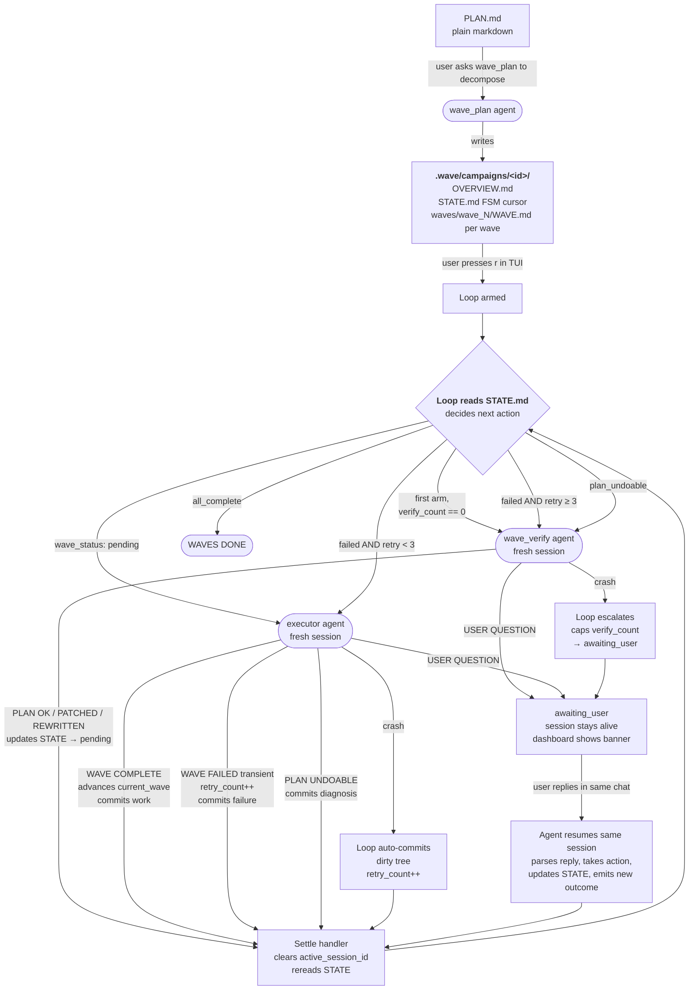

# The wave system

Long agent sessions degrade. The wave system splits big tasks across many small fresh sessions, persists progress on disk, and recovers from failures by patching the plan or asking for help — all without the user having to babysit between waves.

This document covers both the **why** (context window mechanics) and the **how** (the actual algorithm: agents, FSM, recovery paths, dashboard).

## TL;DR

You write a plan in plain markdown. The system splits it into chunks called waves. Each wave runs in a fresh AI session — fresh because AI gets dumber the more you talk to it in one conversation, so we reset between chunks. Progress lives in a file on disk so any session can be killed and the system resumes from exact state. If a wave fails, the system retries up to 3 times. If retries don't help, a separate "verifier" AI looks at the plan + the failure, and either patches the plan or asks you what to do. If the verifier also gets stuck, it asks you in chat — and you reply normally, the same AI picks up your answer mid-conversation and keeps going. Every action commits to git, success or failure, so you have a full audit trail.

## Why waves instead of one long session

The standard agentic workflow is: plan in one session, build in the same session (or the next one). This works for small tasks. For anything that takes more than 20-30 minutes of agent time, it falls apart.

### The context window problem

Two things go wrong as a session grows, and they compound each other.

**The window is not a notebook.** It's a sliding window. As a session grows, early details get compacted or evicted entirely. The agent loses the precise context it needs — file paths blur, constraints disappear, earlier decisions get contradicted.

- **Early details rot.** The agent read a file at the start. By the time it matters, the agent's memory of it is shallow or wrong.
- **Compaction makes knowledge lossy.** The model's internal summary of what happened 50 tool calls ago is not the same as actually knowing what happened.
- **Late-stage errors compound.** When something breaks at step 40, the agent doesn't have the context from step 5 that would explain why. It guesses. It guesses wrong.

**The model itself gets worse as context fills up** — even before anything gets evicted. Transformers attend over the full sequence for every token they generate. As that sequence grows, attention becomes diluted. The model is less precise about which details matter, less reliable at following constraints stated earlier, more likely to hallucinate or contradict itself. Research on long-context retrieval consistently shows accuracy drops in the middle of long contexts ("lost in the middle"), and instruction-following quality declines as the prompt-to-completion ratio shifts. A model at 30k tokens is genuinely a better reasoner than the same model at 150k tokens — not because it forgot something, but because it's spread thinner.

These aren't separate problems. A long session both evicts old context and degrades the model's ability to use whatever context remains. Bigger context windows don't fix this — they just delay the eviction while the attention dilution continues to build from the start.

### What waves do differently

Each session loads only what it needs (`STATE.md` + `OVERVIEW.md` + the current `WAVE.md` + any supplementary docs). That's the fixed overhead. The rest of the context window — ideally the majority of it — is available for actual work: reading source files, writing code, debugging. Goal: never occupy more than ~100k tokens total, including the work itself.

Each session starts fresh. There's no degraded memory from the previous wave. The agent reads the state file, loads exactly what it needs for the current wave, and works with full context clarity.

Progress lives on disk in `STATE.md`, not in any agent's memory. A fresh session reads it and knows exactly where to pick up. This is what makes the system fault-tolerant — a degraded session, a crashed session, a session you want to abandon and restart, none of them lose progress.

The codebase itself is the other half of inter-wave state. Previous waves produce code on disk. Subsequent waves read those actual files to understand what exists — not a summary, the real files. Inter-wave communication is zero-cost and perfectly accurate.

## The system in one diagram



## Three agents

The system uses exactly three agents. Anything more would be theatre.

| Agent           | Role                                                                                                  | Scope                                  |
| --------------- | ----------------------------------------------------------------------------------------------------- | -------------------------------------- |
| `wave_plan`     | Decompose a plan document into a campaign directory.                                                  | Read-only outside `.wave/`             |
| `wave_verify`   | Sanity-check a fresh campaign; on execution failure, patch or rewrite the plan in place; ask the user when it can't decide alone. | Broad permissions; behaviorally `.wave/`-only |
| executor (caveman/build/your choice) | Run one wave: read its WAVE.md, dispatch sub-agents, run verification, commit, update STATE. | Full coding permissions                |

`wave_plan` and `wave_verify` are loop-managed (you don't invoke them manually after the first decomposition). The executor agent is whatever you configured in the campaign — usually `caveman` for cheapness, `build` for verbose explanations.

## File layout

A campaign lives entirely under `.wave/`:

```
.wave/
  active                          <- one-line file: the active campaign-id
  campaigns/
    <campaign-id>/
      STATE.md                    <- mutable FSM state. Every agent reads + writes this.
      artifacts/                  <- gitignored. Wave-side artifacts: screenshots, logs.
      plan/
        AGENT_INSTRUCTIONS.md     <- static entry point. Generated by wave_plan, never modified.
        OVERVIEW.md               <- project context every session reads.
        [optional reference docs] <- task-dependent: SCHEMA.md, CONTRACTS.md, etc.
        waves/
          wave_0/
            WAVE.md               <- task list for this wave
            NOTES.md              <- created on failure: append-only attempt log
            [optional supplementary files]
          wave_1/
            WAVE.md
          ...
```

`STATE.md` is the canonical FSM cursor. It contains a YAML block at the top (the cursor itself) and a markdown table (one row per wave with status, session id, commit SHA, notes).

## STATE.md schema

```yaml
campaign_id: <id>
plan_source: <path to original plan, relative to repo root>
executor_agent: <name>            # caveman | build | etc.
executor_model: ""                # "" = use codemaxxxing's default model; or pin like "anthropic/claude-sonnet-4-5"
executor_variant: ""              # "" or variant key
current_wave: 0                   # index of the wave to execute next
wave_status: pending              # see "wave_status values" below
failure_kind: ""                  # see "failure_kind values" below
retry_count: 0                    # transient retries on the current wave
verify_count: 0                   # total wave_verify sessions completed
user_question: ""                 # set by any agent emitting USER QUESTION
loop_state: idle                  # idle | armed | paused — TUI-managed
active_session_id: null           # loop-managed; never touched by agents
active_session_kind: ""           # "" | "executor" | "verifier" — loop-managed
total_waves: <N>
session_count: 0
created: <YYYY-MM-DD>
last_updated: <YYYY-MM-DD>
```

### `wave_status` values

| Value           | Meaning                                                                                  |
| --------------- | ---------------------------------------------------------------------------------------- |
| `pending`       | Idle, ready for the loop to spawn the next agent.                                        |
| `running`       | An agent's session is in flight.                                                         |
| `complete`      | The wave finished but `current_wave` hasn't advanced yet (transient).                    |
| `failed`        | The wave hit a transient failure (executor's own bug). Loop will auto-retry up to `RETRY_CAP=3`. |
| `plan_undoable` | The wave reported the spec itself is wrong. Loop will hand to the verifier.              |
| `awaiting_user` | An agent surfaced a blocking question. Session is paused, not ended; user reply resumes it. |
| `all_complete` | All waves complete. Terminal state.                                                      |

### `failure_kind` values

| Value         | Meaning                                                                                 |
| ------------- | --------------------------------------------------------------------------------------- |
| `""`          | Not in a failure state.                                                                 |
| `transient`   | Executor's own bug. Retryable.                                                          |
| `undoable`    | Spec is wrong. Verifier should patch.                                                   |
| `crash`       | Session ended without state update (OOM, network, killed). Loop infers and auto-commits. |
| `cancelled`   | User pressed `i` in the dashboard. Loop refuses to auto-retry until user explicitly clears. |

## The loop

The loop is a finite state machine in `packages/opencode/src/wave/loop.ts`. It has six methods exposed via the TUI: `arm`, `pause`, `resume`, `interrupt`, `next`, `stop`. Plus three new ones added with the dashboard work: `clearCancelled` (resume from a cancelled state), `clearQuestion` (dismiss an awaiting_user prompt without responding), and (internal) the bus subscriber that watches session settle events.

### Spawn decision

When the loop needs to spawn something (on arm, on next, after a settle), it calls `spawnPerState(state)`:

| Current state                                              | Spawn          |
| ---------------------------------------------------------- | -------------- |
| `verify_count == 0 && wave_status == pending && current_wave == 0` | wave_verify (initial sanity-check) |
| `wave_status == pending`                                   | executor       |
| `wave_status == failed && retry_count < 3`                 | executor (retry) |
| `wave_status == failed && retry_count >= 3`                | wave_verify (escalation) |
| `wave_status == plan_undoable`                             | wave_verify    |
| `wave_status == awaiting_user / all_complete / running`    | nothing        |

Three guards short-circuit before any spawn:

1. If `active_session_id` is non-null, refuse to spawn (something's already running).
2. If `failure_kind == "cancelled"`, refuse to spawn (user pressed interrupt; needs explicit `c` to resume).
3. If `verify_count >= 3` and we'd be spawning the verifier, escalate to `awaiting_user` instead.

### Settle handler

When a session settles (status transitions to idle), the loop's bus subscriber fires:

1. Reject if the settled session id doesn't match `active_session_id`.
2. Short-circuit on `awaiting_user` (session is paused conversationally, not ended).
3. Detect verifier vs executor via `Session.get(sid).agent === "wave_verify"`.
4. Branch:
   - **Executor crash** (`wave_status: running` + executor): auto-commit dirty tree as `wave N (crashed): ...`, mark `wave_status: failed`, `failure_kind: crash`, bump `retry_count`.
   - **Verifier crash** (`wave_status: failed/plan_undoable` + verifier didn't progress): set `wave_status: awaiting_user`, cap `verify_count` so user retries don't loop the verifier into another crash.
   - **Normal settle**: clear `active_session_id` and `active_session_kind`.
5. Re-read state and call `spawnPerState` if the loop is armed.

This is what makes the loop fully automatic — the user arms once, then every wave completion auto-spawns the next without intervention.

## Set-phrase contract

Every agent emits a set phrase as the last line of its turn. The loop pattern-matches on these to decide what to do next. (The actual control flow is driven by STATE.md mutations, but the set phrases also serve as a human-readable signal in the chat.)

| Agent     | Set phrase                            | Meaning                                                  |
| --------- | ------------------------------------- | -------------------------------------------------------- |
| executor  | `WAVE COMPLETE`                       | Success. STATE updated to advance `current_wave`.        |
| executor  | `WAVE FAILED`                         | Transient failure. STATE updated, retry_count bumped.    |
| executor  | `PLAN UNDOABLE`                       | Spec is wrong. STATE marked plan_undoable.               |
| executor  | `WAVES DONE`                          | Hit terminal `all_complete` on entry; nothing to do.     |
| executor  | `WAITING FOR USER: <text>`            | (Defensive) Already-paused campaign respawned.           |
| executor  | `UNEXPECTED RESPAWN: ...`             | (Defensive) Spawned while paused.                        |
| executor  | `USER QUESTION: <one-line summary>`   | Blocking question. Full context in chat above.           |
| verifier  | `PLAN OK`                             | Campaign approved as-is.                                 |
| verifier  | `PLAN PATCHED`                        | Small inline edits applied.                              |
| verifier  | `PLAN REWRITTEN`                      | One or more WAVE.md / OVERVIEW.md substantially rewritten. |
| verifier  | `USER QUESTION: <one-line summary>`   | Verifier needs user judgment.                            |

`USER QUESTION` does not end the session. The agent stops its turn but the session stays alive. The user opens the session in chat (the dashboard tells them to), reads the rich contextual question, replies normally. The same agent resumes mid-conversation, parses the reply, takes action, updates STATE, emits the next set phrase. This means user questions are conversational, not transactional — there's no "answer the question via STATE.md edit" step.

## NOTES.md (per-wave diagnostic log)

On any non-success outcome, the executor appends to `waves/wave_N/NOTES.md`. Append-only across attempts; each retry adds a new section.

```markdown
## Attempt 1 — failed (transient)
**Session:** ses_xxx
**Commit:** abc1234
**Date:** 2026-05-06
**Decision on entry:** first attempt

### What happened
<narrative>

### What failed
<exact commands run, exit codes, error output>

### Diagnosis
<analysis of root cause>

### Tried in-session
<fix attempts before giving up>

### Recommendation
<for the next attempt, the verifier, or the user>

---

## Attempt 2 — plan_undoable
...
```

The verifier reads NOTES.md when invoked post-execution to understand what the executor tried and why it failed. The dashboard exposes the file via the `v` keybind.

## Always commit

Every wave session — success, failure, undoable, crash, paused — produces a git commit. This is non-negotiable.

| Outcome           | Commit message format                       |
| ----------------- | ------------------------------------------- |
| Success           | `wave N: <short description>`               |
| Transient failure | `wave N (failed): <one-line reason>`        |
| Plan undoable     | `wave N (undoable): <one-line reason>`      |
| User question     | `wave N (paused): user question`            |
| Crash             | `wave N (crashed): session ended without state update` (loop auto-commits) |
| Verifier change   | `wave verify: <brief summary>`              |

Why every outcome commits:

- **Audit trail.** You can read git log and see exactly what happened across every attempt.
- **Clean working tree between sessions.** A retry session starts from a known-clean state. The executor decides on entry whether to revert prior failure commits (fresh start) or build on top (continue).
- **Crash recovery.** If a session dies mid-write, the loop's auto-commit-on-crash captures whatever was on disk so the next session has a clean tree.

Failure commits stay local — never pushed. They're for you and for the verifier, not for shared history.

## Recovery paths

### Transient retry

Wave fails with `failure_kind: transient`. Loop auto-retries up to 3 times, each in a fresh session, each appending a new attempt section to NOTES.md. Each retry session decides on entry whether to reset (revert prior failure commits via `git revert --no-commit`) or continue (build on partial work). Decision recorded in NOTES.md.

### Verifier amendment

Either the executor declared `PLAN UNDOABLE` outright, or `retry_count` hit 3. Loop spawns wave_verify in a fresh session. The verifier:

1. Reads the entire campaign + the failed wave's NOTES.md.
2. Probes reality (it has full bash) — runs `<toolchain> --version`, validates that gotchas in WAVE.md are real, etc.
3. Decides scope: `PLAN OK` (rare in post-execution), `PLAN PATCHED` (one-file fix), `PLAN REWRITTEN` (multi-wave rewrite + cascade-check downstream waves), or `USER QUESTION` (genuine ambiguity).
4. Updates STATE.md: clears the failed wave's failure state, sets `wave_status: pending` so the loop respawns the executor against the patched spec.
5. Commits its changes as `wave verify: ...`.

Hard cap: 3 verifier sessions per campaign. After that, the verifier's own prompt forces `USER QUESTION` instead of attempting another amendment.

### User question (conversational pause)

An agent emitted `USER QUESTION`. STATE.md has `wave_status: awaiting_user` and `user_question: <one-line summary for the dashboard>`. The session is alive, paused mid-turn.

In the dashboard you see a prominent `USER ATTENTION NEEDED` banner with the summary. To respond:

1. Press `↵` on the wave row to open the session in chat.
2. Read the full contextual question (the agent wrote 2-3 concrete options — A/B/C — above the set phrase).
3. Reply normally, like any other chat message.
4. The agent picks up your reply, takes action, updates STATE.md, emits the next set phrase.
5. Loop sees the new state, auto-advances.

If you want to dismiss the question without responding (e.g. you've decided to abandon the wave), press `q` in the dashboard. This marks the wave cancelled and stops the loop.

### Cancellation

Press `i` in the dashboard. The active session is cancelled, `failure_kind: cancelled`, `loop_state: idle`. The loop refuses to auto-retry cancelled waves — you must press `c` to clear the cancelled state, which signals "actually, try again." This protects against accidental re-arms after a deliberate stop.

### Crash

A session ended without updating state (OOM, kill, network drop). Loop's settle handler detects `wave_status` still `running` (executor) or `failed/plan_undoable` (verifier) and:

- Executor crash: auto-commits dirty tree, marks `failure_kind: crash`, bumps `retry_count`. Falls through to retry/escalate logic.
- Verifier crash: sets `awaiting_user` with a system-generated question, caps `verify_count` to prevent infinite loops.

## Dashboard

Open with `/wave`. Shows:

- **Header**: campaign id + plan path + executor agent/model + completed/total wave count.
- **Loop strip**: `loop` state + `wave` status + retry count if non-zero + verify count if non-zero + active session indicator. Active session shows a `[verifier]` or `[executor]` badge so you know which agent is in flight.
- **USER ATTENTION banner**: prominent yellow box at the top when `wave_status: awaiting_user`, with the question text and a hint to open the session.
- **Wave table**: one row per wave with #, status (color-coded: complete=green, running=primary, failed=red, undoable=red, paused=warning), session id, commit SHA, notes. Failed/undoable rows show the failure_kind in the status cell.
- **Footer**: contextual keybind hints. Changes based on state — when awaiting_user, hints flip to show "↵ open session to reply / q dismiss".

### Keybinds

| Key       | Action                                                         |
| --------- | -------------------------------------------------------------- |
| `↑↓` `jk` | Navigate wave rows                                             |
| `↵`       | Open the selected row's session in chat                        |
| `r`       | Arm the loop (or resume from paused)                           |
| `space`   | Pause the loop                                                 |
| `n`       | Manually spawn next (bypasses arm)                             |
| `i`       | Interrupt active session and mark wave cancelled               |
| `s`       | Stop the loop                                                  |
| `c`       | Clear cancelled wave back to pending (signals "try again")     |
| `q`       | Dismiss the awaiting_user question without responding          |
| `v`       | View NOTES.md for the selected wave (overlay)                  |
| `f5`      | Manual refresh                                                 |
| `esc`     | Back to home                                                   |

## How to use it

### 1. Write a plan

Plain markdown anywhere. The H1 becomes the campaign-id slug (`# Marketing Rebuild` → `marketing-rebuild-2026-05-06`).

For larger projects, you can produce the plan via either built-in mode:

- `/mode plan` — iterative pair-planning, asks clarifying questions
- `/agent plan_structured` — linear 4-phase pipeline (survey → organize → write → verify)

Either drops the result in `.opencode/plans/`.

### 2. Decompose

```
/wave-plan
```

This switches to the wave_plan agent and pre-fills the prompt. Tell it the plan path and the executor agent. Model is optional — leave unspecified to use whatever model codemaxxxing opens new sessions with.

```
Decompose @.opencode/plans/my-plan.md. Executor agent: caveman.
```

The agent produces `.wave/campaigns/<id>/` and exits. No source code is modified.

### 3. Arm and walk away

Open `/wave` in the TUI. Press `r`.

What happens automatically:

1. Verifier runs first (`verify_count == 0`) — sanity-checks the campaign, probes reality, patches obvious spec drift before any executor wave runs.
2. Executor spawns for wave 0. Runs to completion. Commits. Updates state.
3. Loop sees the settle, sees `wave_status: pending` for wave 1, spawns the next executor.
4. Repeats until `all_complete`.

If a wave fails: 3 retries, then verifier amendment, then user question. You only intervene when the system explicitly asks.

### 4. Respond to questions

When the dashboard shows the USER ATTENTION banner, open the session via `↵` and reply in chat like a normal conversation. The agent resumes its turn with your reply in context.

## Cost

API pricing is `input_tokens × x + output_tokens × y`. Every API request in a conversation sends the entire conversation history as input. The first request sends the system prompt plus one message. The 50th request sends the system prompt plus every message, tool call, and tool result that came before it. Total input token spend grows quadratically with the number of exchanges in a single session.

Waves cut this by resetting the accumulation. Four sessions of 20 exchanges each have far lower total input cost than one session of 80 exchanges, even though the same amount of work gets done. Each session starts with a small fixed context (the wave files) instead of inheriting the full history.

Subagent parallelism within each wave gives you the same multiplier inside a wave: subagents run in isolated context windows, so their exchanges never accumulate in the parent's history. A wave orchestrator that launches three subagents each doing 20 exchanges only pays for its own short conversation, not the 60 exchanges happening inside the subagents.

The verifier adds cost — typically one verifier session per amendment, capped at 3 per campaign. Worth it: a verifier session typically costs less than one wasted executor wave that would have failed against a broken spec.

## When not to use waves

If the task fits in one session — roughly, if you can plan and build it in under 20 minutes of agent time without the agent losing track of things — just do it directly. Waves add overhead (the decomposition session, the file structure, the per-session startup, the verifier sanity-check). That overhead only pays off when the alternative is a degraded long session that produces broken output you have to fix anyway.

Bad fits for waves:

- **Trivial scripts** — `write a python script that does X`. One session, done.
- **Exploratory questions** — "how does this auth flow work?" Use explore subagents directly.
- **Single-file refactors** — usually fits in one focused session.

Good fits for waves:

- **Multi-component features** — backend + frontend + tests, where each part is its own wave.
- **Migrations** — schema + code + data + verification across many files.
- **Greenfield with multiple distinct phases** — scaffold + implement + test + integrate.
- **Anything that needs to survive crashes** — the on-disk FSM means you can kill a session anytime and resume.

## Architectural choices

### Why three agents and not seven

Earlier drafts of this system had separate agents for plan-review, decomposition-review, wave-review, amendment, and grounding probes. Each agent adds a fresh session, more tokens, more prompts to maintain, more failure modes. The current design collapses all five roles into the verifier and lets the executor self-report failure kind. The verifier's prompt is broad-mandate ("look at the campaign and decide what's needed") rather than narrow.

### Why the plan is mutable

Earlier waves treated WAVE.md and OVERVIEW.md as frozen artifacts of the planning step. Reality always reveals planner errors during execution. Making the plan mutable (verifier can edit it in place, with cascade-check on dependent waves) closed the failure-recovery gap that previously required manual intervention.

### Why conversational pauses, not stop-and-restart

`USER QUESTION` could end the session and have the user "answer" via STATE.md edit. Conversational resume is much better UX: the agent's full context for the question is right there in the chat, and the user replies in their natural channel. The session stays alive between the agent's pause and the user's reply.

### Why the loop owns active_session_id

The loop sets `active_session_id` when it spawns. Agents must never write to it. If an agent clears it as part of its end-of-turn STATE update, the loop's settle handler sees a mismatch and skips the auto-spawn. This was a real bug — the executor protocol used to write `active_session_id: null` on every outcome, breaking auto-advance between waves. Fixed by giving the loop sole ownership.

### Why every outcome commits

The earlier system only committed on success. Failures left the working tree dirty, NOTES.md got lost across retries, and the loop couldn't tell partial work from complete work. Always-commit gives a clean tree between sessions, full git audit trail, and a deterministic resume point. The minor cost is some `wave N (failed)` noise in `git log`.

### Why the subscriber is per-directory, not global

`InstanceState.make` binds the bus subscriber's fiber to the directory's lifetime, not the first-HTTP-request's lifetime. Without this, the subscriber dies when the layer is first materialized inside an HTTP handler scope. See `aa04e20e1` (commit) for the diagnosis. Trade-off: each open directory has its own subscriber filtering global session events. Per-event cost is microseconds, bounded by directories × session events. Negligible.

## Pointers

- Loop FSM: `packages/opencode/src/wave/loop.ts`
- State schema + parser/serializer: `packages/opencode/src/wave/state.ts`
- Wave service (per-directory state, file I/O): `packages/opencode/src/wave/wave.ts`
- Dashboard: `packages/opencode/src/cli/cmd/tui/routes/wave/index.tsx`
- Wave context (TUI ↔ HTTP): `packages/opencode/src/cli/cmd/tui/context/wave.tsx`
- Wave HTTP API: `packages/opencode/src/server/routes/instance/httpapi/handlers/wave.ts`
- Bootstrap (loop init): `packages/opencode/src/project/bootstrap.ts`
- Agent prompts: `custom_agents/wave_plan.md`, `custom_agents/wave_verify.md`
